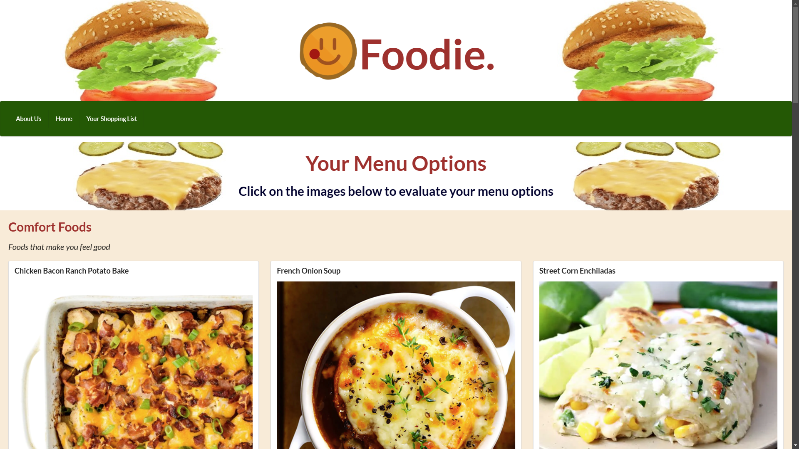
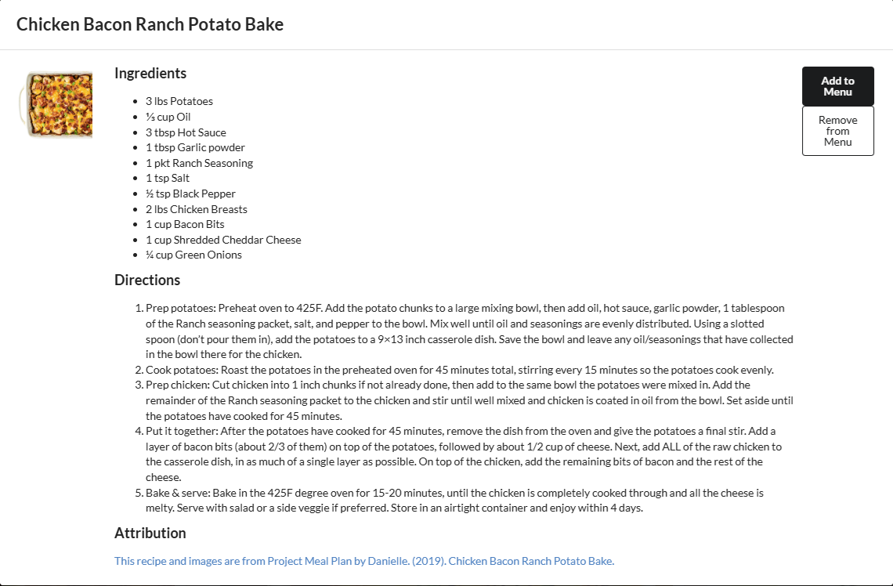

# Foodie - Your Meal Prepping Companion

## Description

- Our team was motivated to help those busy individuals more quickly come up with a variety of meals for the week. 
- Our focus was on inspiring our users with recipes and making it easy for them to generate their grocery list for the week. 
- Our Product solves the problem of the time commitment it takes to structure a fresh menu and generate the grocery list for busy families.
- Our team learned that it is challenging to take recipes that have quantities and units and extract the ingredients to seamlessly create a grocery lists that is deduplicated. 

## Installation

This product is a suite of .html, javascript, and image files. To get started, visit the last deployed version of our webpage at [GitHub pages](https://musserdn.github.io/ProjectOne/).

To install locally, clone the repository from the [Github](https://github.com/musserdn/ProjectOne), pull down, and open the `index.html` file with your default browser.

## Usage

Provide instructions and examples for use. Include screenshots as needed.

1. Navigate to [Foodie.](https://musserdn.github.io/ProjectOne/);
2. Review the plethora of recipes organized by category;
3. Click on the image of the recipe to open up the modal detail;
4. Review the Ingredients and Instructions;
5. Click `Add to Menu` to select a recipe;
6. If you accidentally added the wrong recipe: click image and click `Remove from Menu`
7. Repeat for reach recipe you'd like to add to your list; 
8. When you're done selecting; click on the `Your Shopping List` page; 
9. Review your selected recipes and make sure they're exactly what you're expecting.  If not, go back and modify from the `Home` page;
10. Your ingredient list will populate below your recipes;
11. (Optional) Click the print button to have a paper copy to bring with you on your next grocery shopping experience;
12. Lastly, once you're done with making your recipes - hit the clear button to start fresh next time!

## Credits
The following individuals have contributed to this product
- [Natalie Grindraux](https://github.com/ngin2894)
- [Aiyesha Roberts](https://github.com/Ahseyia17)
- [Dan Musser](https://github.com/musserdn/)

Attribution for recipe creation is provided on each recipe card.

## License

This project is licensed under the MIT License - see the [LICENSE](LICENSE) file for details.

## Badges

